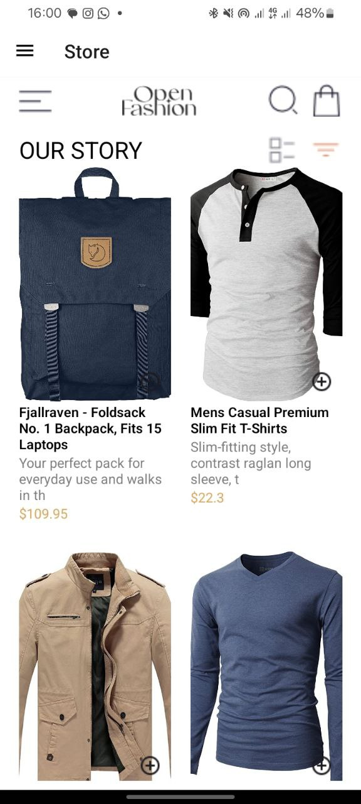
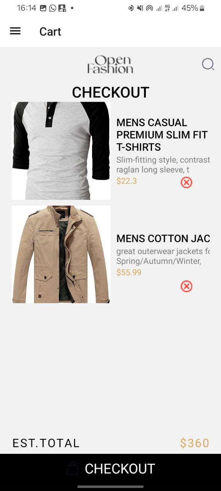
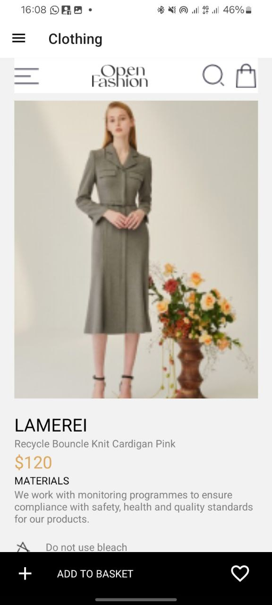
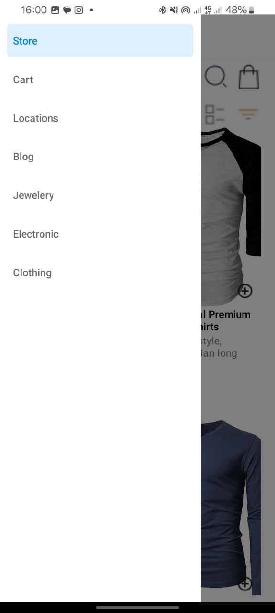

When creating my React Native app for a clothing store, I focused on ensuring a user-friendly interface and reliable data management. I chose a grid layout for displaying products, utilizing a FlatList with two columns for a visually appealing and efficient presentation. Each product is displayed as a card with a touchable add item button, allowing users to easily add and delete items.

For state management, I used React's useState and useEffect hooks. The useState hook manages the list of items, and the useEffect hook is essential for loading and saving data. To ensure data persistence, I implemented AsyncStorage, which allows the app to store and retrieve the shopping list between sessions. This setup ensures that users have a seamless experience with their data consistently saved, making the app both functional and reliable.

